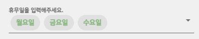

# 휴무일

휴무일을 저장할 때 string으로 담다 보니 input 박스로 보여줄 때 split으로 해체해서 보여줬다가 다시 join해야 하는 경우가 생겼다.

즉, string을 관리하는 방법



1. 휴무일을 보여주기

   ```vue
   <template>
       <div>
           <v-select
           :items="days"
           v-model="off"
           label="휴무일을 입력해주세요."
           multiple
           chips
           required
           ></v-select>
       </div>
   </template>
   
   <script>
       import http from "@/util/http-common";
       export default {
           name: "StoreInfoChangeView",
           data () {
               return {
                   off: [],
               }
           },
           methods : {
               modify () {
                   this.storeDto.offDay = this.off.join;
                   
                   var selected = [];
                   if (this.off.length >0 && this.off[0].value != undefined) {
                       this.off.map((day) => {
                           selected.push(day.value);
                       });
                       this.storeDto.offDay = selected.join(",");
                   } else {
                       this.storeDto.offDay = Array.from(this.off).join(",");
                   }
               }
           }
       }
   
   </script>
   ```

   

```
* Array.from(this.off).join(",")
Array.from() 메서드는 유사 배열 객체(array-like object)나 반복 가능한 객체(iterable object)를 얕게 복사해 새로운	Array 객체를 만듭니다.

* .join(",")
리스트를 각 요소를 ,으로 합쳐서 스트링으로 만들기

* .split(",")
string을 , 기준으로 나눠서 리스트로 만들기

4. .map((day) => {
    })
요소들 별로 어떻게 하기, for문과 비슷
```


2. 휴무일 정렬하기

   ```vue
   <script>
   export default {
       methods: {
           modify() {
               // 위의 코드
               if (this.storeDto.offDay.length >= 5) {
                   // 지금 this.storeDto.offDay는 string으로 되어있으니 split으로 쪼개고, 그 하나 값을 map 사용해서 offDaylist라는 리스트에 하나씩 집어넣기
                     this.storeDto.offDay.split(",").map((day) => {
                       this.offDaylist.push(day);
                     });
                   // 정렬할 함수 지정
                     const daySorter = {
                       월요일: 1,
                       화요일: 2,
                       수요일: 3,
                       목요일: 4,
                       금요일: 5,
                       토요일: 6,
                       일요일: 7,
                     };
                     this.offDaylist.sort(function sortBydaySorter(a, b) {
                       return daySorter[a] - daySorter[b];
                     });
                   // realoffDayList라는 string에 offDaylist라는 리스트의 값을 합쳐서 string에 추가
                     this.realoffDayList = this.offDaylist.join();
                   } else {
                       // 휴무일이 한개이하인 매장은 정렬하지 않고 그냥 그대로
                     this.realoffDayList = this.storeDto.offDay;
                   }
           console.log(this.realoffDayList);
           }
       }
   }
   </script>
   ```

   