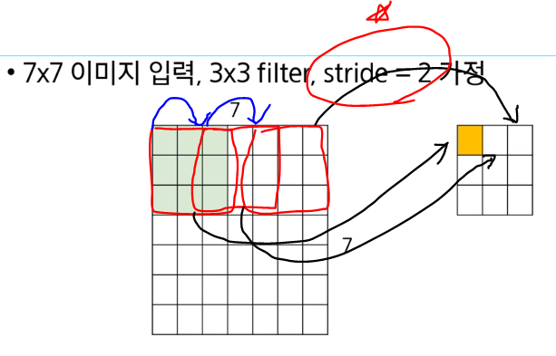

# CNN

## convolution이란?

input *(inner product: 내적) filter => output 

filter을 잘 정하는 것이 중요함

## Convolution neural net

* local 연산을 학습
* parameter 공유

## CNN의 구성 layers

- convolutional layer

  - depth * width * height => 공간 구조 보존

  - 항상 depth는 보존

  - filter로 image를 훑으면서 내적을 계산함

  - 출력 사이즈 : (N-F) / stride +1

  - N= 7, F = 3, stride = 2일 때 

    

* pooling layer
  * ex) 이미지 안에서 눈의 여부만을 강인하게 찾는 경우 
  * max pool: activation pixels 중에서 가장 큰 값을 모아놓는 경우
  * average pool: ,, 평균값을 보여주는 경우
* activation function
  * 작은 값은 무시, 큰 값은 크게

## CNN은 어떤 지식을 학습하는가

* 계층적 특징 표현
  * convolution layer의 적층을 통해 자연스럽게 유도된 특징
  * 