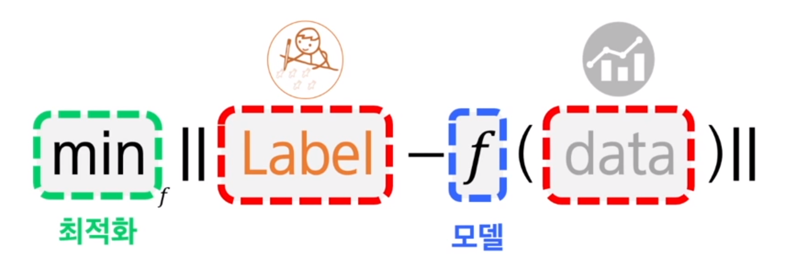

# sub PJT 1

[TOC]

## 학습

* CNN(Convolutional Neural Network): 이미지 처리시 사용
* Transformer: 자연어 처리에 사용
* PyTorch: 딥러닝 프레임워크 

## 목표

* 간단한 인공 신경망 모델, 트레이닝 코드 작성
* 트랜스포머 실습을 통해 자연어 처리의 기본 개념 이해

## 주요 기술 스택

1. python

   현대적인 스크립팅 객체 지향 프로그래밍 언어

   객체지향적 특징과 많은 라이브러리 서포트로 인해 머신러닝을 위한 중요 언어로 굳혀짐

   인공지능 및 기계학습을 위한 라이브러리 多 : tensorflow, pytorch, scikit-learn, pylearn2 등

2. [pyTorch](https://pytorch.org/)

   머신러닝 및 딥러닝 개발 프레임워크

   특징: simplicity, great API, preformance, large community

3. [numpy](https://numpy.org/)

   [numpy 함수들과 실행결과](http://taewan.kim/post/numpy_cheat_sheet/)

   scientific computing을 파이썬에서 가능하게 하기 위해서 만들어진 python 패키지

   vector, matrix, tensor를 쉽게 다룰 수 있는 함수가 많음

   linear algebra, fourier transform, random number capabilities 에 대한 함수 제공

4. [matplotlib](https://matplotlib.org/)

   [matplotlib 공식 튜토리얼 자료](https://matplotlib.org/stable/tutorials/index.html)

   데이터 시각화를 위해 사용되는 파이썬 라이브러리

   다양한 형태의 그래프 그릴 수 있음

   + [seaborn 라이브러리](https://seaborn.pydata.org/)와 함께 사용 → 통계 기능과 색테마 지원

## 머신러닝, 딥러닝

* 머신러닝
  * 컴퓨터가 데이터를 학습함으로써 기존 데이터와 유사하지만 처음 보는 데이터를 자동으로 해석할 수 있게 하는 기법
  * 모델링
    * 최적의 알고리즘을 생성하기 위해서 알고리즘의 틀을 디자인 해야함
    * ex) 선형관계 vs 비선형관계
  * 손실함수
    * 최적이 존재하려면 서로 다른 변수의 조합들을 비교할 수 있는 척도가 필요
    * 손실을 최소화하는 변수를 찾기 위해 손실을 줄이는 방향으로 '최적화' 진행
    * 최적화의 대상: 변수
    * 변수들의 값이 바뀌면 모델을 통해 나온 결과의 값도 달라짐
* 딥러닝
  * 머신 러닝 방법 중 하나
  * 심층 신경망을 사용한 머신 러닝 방법
    * 심층 신경망(DNN): 더 복잡하고 다양한 특성 정보를 얻기 위해서 2개 이상의 신경망 층을 쌓은 모델

## 머신러닝의 유형

* 지도학습
  * 정답이 있는 데이터를 학습
* 비지도학습
  * 정답이 없는 데이터를 학습
  * 입력 데이터만 주어진 상황에서 데이터 안의 숨겨진 패턴을 찾아내는 형태의 학습법
* 강화학습

## 기계가 학습을 하는 일반적인 방법

DATA -> [MODEL -> EVALUATE - LOSS -> OPTIMIZATION -> MODEL]  => GOOD RESULT!

관찰 -> 이해 -> 평가 -> 적용 

## 기계 학습

* 계산 / 추론: 함수를 주고 input을 넣으면 output이 나오도록 계산
* 최적화; 한 세트의 input, output을 주고, 관게를 가장 잘 설명하는 함수를 찾는 것
* 일반화: 기존의 학습 패턴을 통해서 새로운 input을 넣어도 output이 나올 수 있게끔 일반화!
* supervised learning - annotation을 통한 학습

## 최적화

* 경사 하강법 gradient descent method

## overfitting, underfitting 해결

* 충분히 많은 양의 데이터
* 모델의 복잡도 줄이기
* 가중치의 regularization 적용하기
* 드롭아웃(drop out)

## 시각적 지각 능력

visual world - sensing - understanding - interpretation